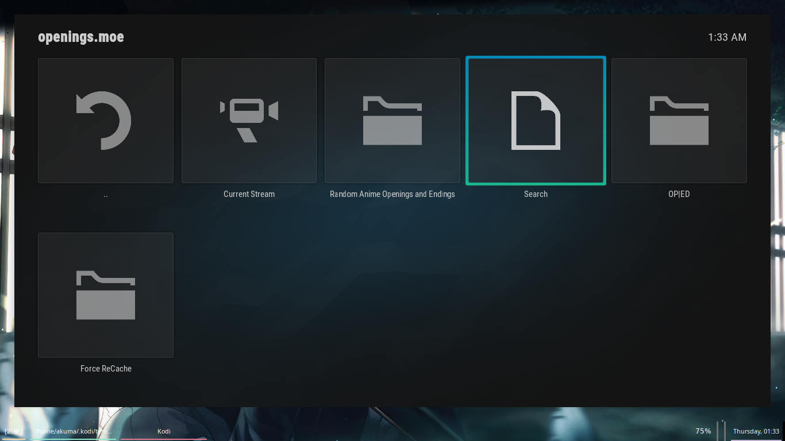
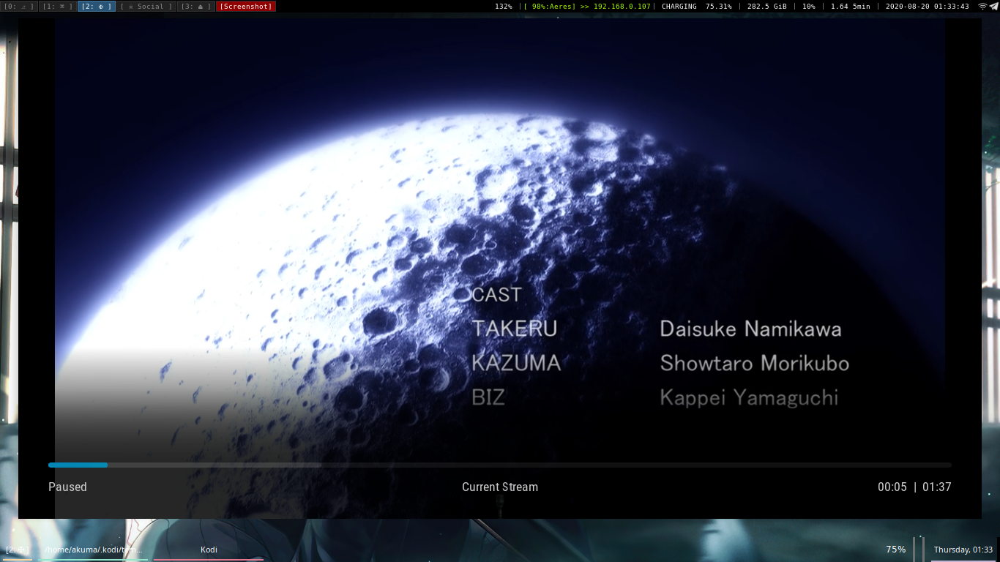
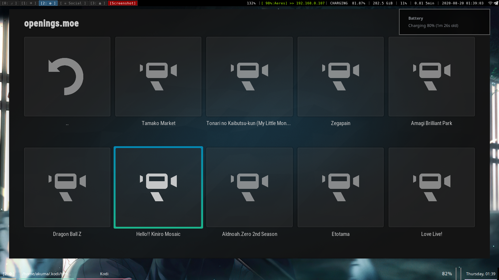

## Openings.moe

A bare simple kodi addon to retrieve and play anime openings and endings randomly. Utilizes openings.moe api system for fetching. Currently, it has been hardcoded to 15 openings fetch (ofcourse, you can fetch while playing and queue more as per your need, or queue less from the available list)

#### To do

- [ ] Search
- [x] Currently Streaming
- [x] Caching on storage 
- [ ] Opening | Ending Bifurcations
- [ ] Notifications
- [ ] Verbose debugging flag
- [ ] Thumbnails 
- [ ] Utilisation of API instead of parsing
- [ ] Fixing currently streaming (parses instead of API)
- [x] ReCache
- [ ] Artist information and Anime information while playing
- [ ] Repository for Addon

#### Screenshots

OP | ED and search are yet to be implemented, you can expect it in next release.

This is totally dependent on your kodi instance and theme, but this is how mine looks. 
Theme: Aura

This is a randomly generated list, it cannot be "enough random" as I have not focussed a lot on randomness but here it works fine

#### Installation

1. Simply click on code
2. Download zip
3. In kodi > Addons > Install from zip
4. select the zip you downloaded (you might have to move it to your kodi instance)
5. Install and Enjoy. 

In case any dependency error arises, simply get vimcasts from official repo as well.

Since I haven't setup the repo, updating will be a bit daunting but its same as Installation. 
It shall be done as soon as I get time. 

Contributions will appreciated, or just enjoy.

For bugs simply open an issue 

##### What to include in bug report?

Enable debug logging in kodi from Settings > System > logging.

1. A screenshot
2. A dump of kodi.log from ~/.kodi/temp/kodi.log (or equivalent location from windows)
3. Do make sure to remove any private information from the log
4. A short note on what you were expecting and what unexpected happened.
